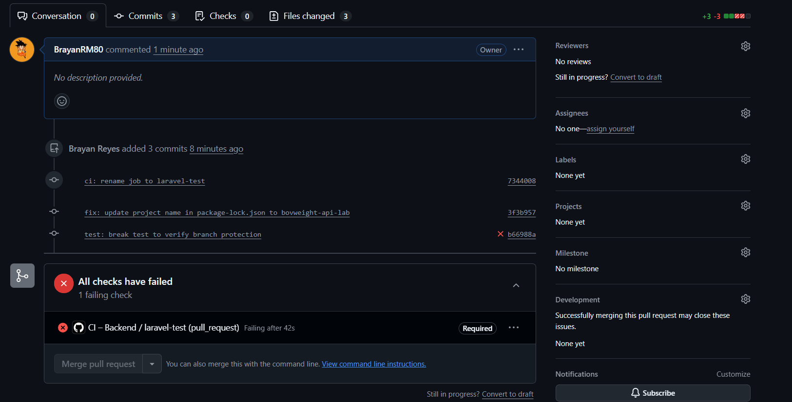
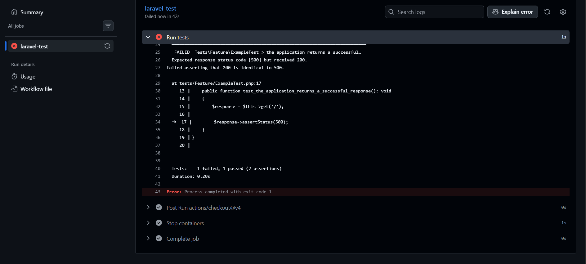
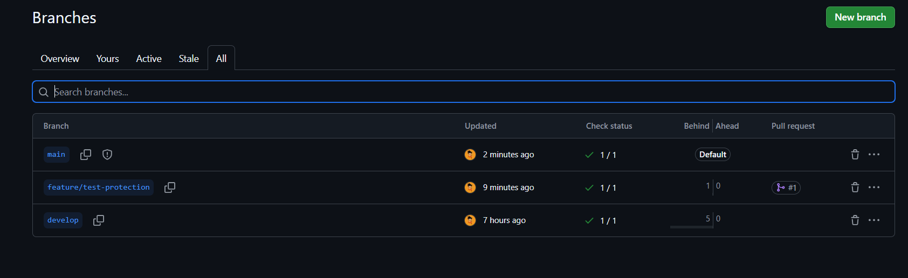
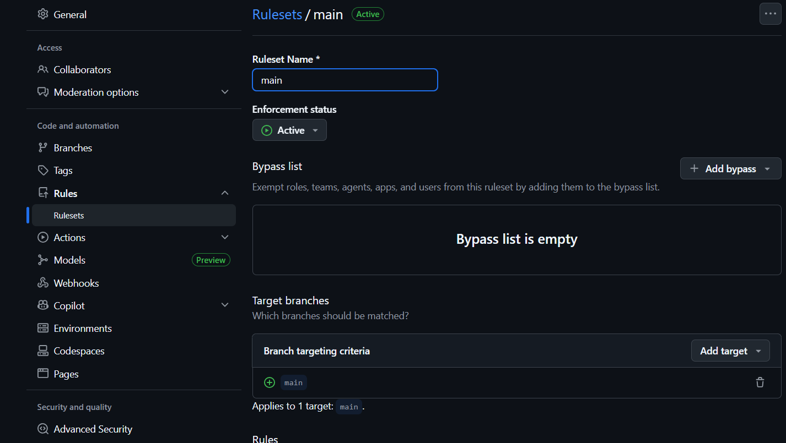
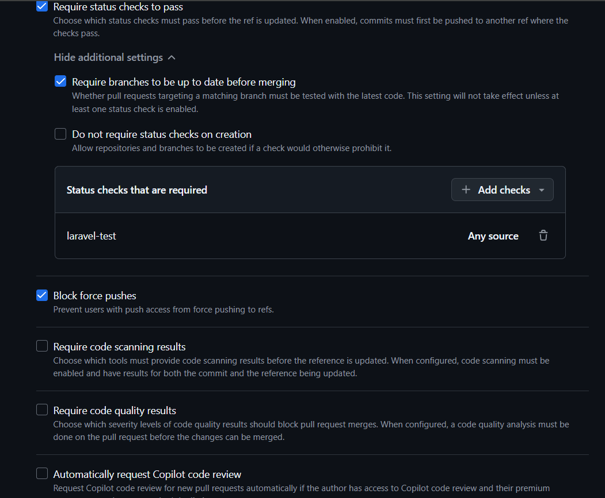

# Lab DevOps - BovWeight API
IF7100 | I Ciclo 2026
 
## Ejercicio 1 - Pipeline CI
 
### ci.yml
El pipeline corre en cada push a `main` y `develop`, y en cada PR hacia esas ramas. Levanta un servicio MySQL 8.0, instala dependencias con Composer, corre migraciones y ejecuta los tests con PHPUnit.
 
### Preguntas
 
**1. ¿Cuánto tardó el pipeline y cuál fue el step más lento?**  
El pipeline tardó 44 segundos. El step más lento fue `Install dependencies` (composer install) porque descarga todos los paquetes desde cero en cada ejecución.
 
**2. ¿Qué pasa en el PR si una prueba falla?**  
El CI corre automáticamente y si falla, GitHub bloquea el merge. El botón "Merge pull request" queda deshabilitado hasta que el check `laravel-test` pase en verde.
 

 
**3. ¿Por qué MySQL y no SQLite?**  
BovWeight usa funciones específicas de MySQL (ENUMs, JSON columns, foreign keys estrictas) que SQLite no soporta igual. Además el proyecto usa MySQL en producción, entonces las pruebas deben correr en el mismo motor para que sean válidas.
 
**4. ¿Qué ventaja tiene `actions/checkout@v4` frente a clonar manualmente?**  
Maneja la autenticación automáticamente, hace un shallow clone optimizado, y está mantenida oficialmente por GitHub. Un `git clone` manual requeriría configurar credenciales y sería más lento.
 
---
 
## Ejercicio 2 - Estrategia de Ramas y Branch Protection
 
| Rama | Propósito | Protección |
|------|-----------|------------|
| `main` | Producción | PR obligatorio + CI verde + no force push |
| `develop` | Integración | CI en cada push |
| `feature/*` | Funcionalidades nuevas | CI en cada push, merge a develop |
| `hotfix/*` | Correcciones urgentes | Merge directo a main y develop |
 
### Branch Protection configurada en `main`
- Require a pull request before merging
- Require status checks to pass → `laravel-test`
- Require branches to be up to date before merging
- Block force pushes

 
### Verificación
Se creó la rama `feature/test-protection` con un test roto a propósito (`assertStatus(500)`). Al abrir el PR, el CI falló y GitHub bloqueó el merge automáticamente, confirmando que la protección funciona.
